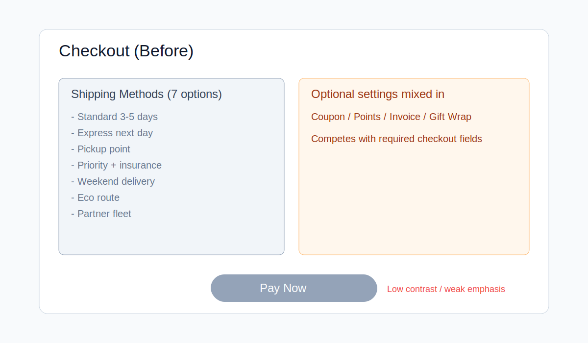
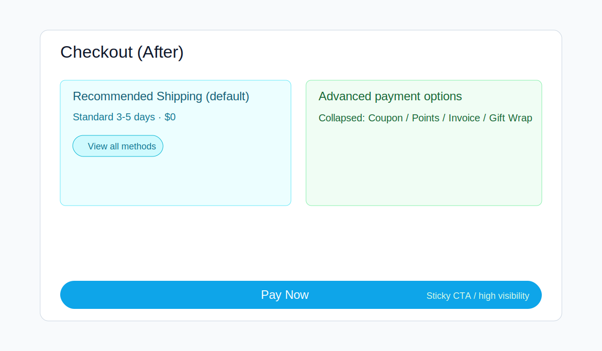
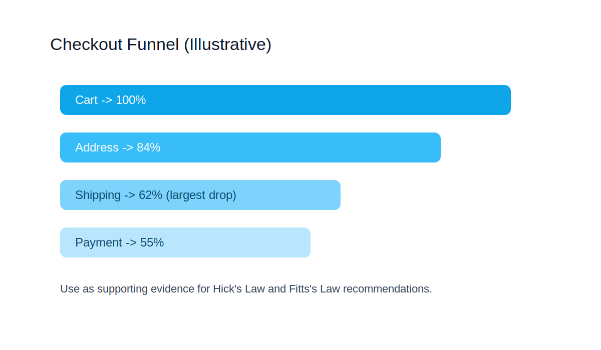

# Laws of UX Skill

A Codex skill that distills core UX design theory from Laws of UX and the user's Notion UX norms into an actionable design decision framework.

This skill is designed for:

- UX/UI critique and heuristic review
- Product flow design
- Frontend implementation guidance
- Interface acceptance checks
- Turning psychological and behavioral UX principles into concrete product decisions

## What It Extracts

The skill organizes UX principles into two layers:

- **Primary laws**: core decision-making principles such as Jakob's Law, Fitts's Law, Miller's Law, Hick's Law, Postel's Law, Peak-End Rule, Aesthetic-Usability Effect, Von Restorff Effect, Tesler's Law, and Doherty Threshold.
- **Secondary laws**: supporting diagnostic principles such as Choice Overload, Chunking, Cognitive Load, Flow, Goal-Gradient Effect, Common Region, Proximity, Similarity, Mental Models, Occam's Razor, Pareto Principle, Selective Attention, Serial Position Effect, Working Memory, and Zeigarnik Effect.

## Purpose

Instead of treating UX laws as decorative citations, this skill turns them into practical questions:

- What should be visible first?
- What should be grouped, hidden, deferred, or removed?
- What should be default, constrained, confirmed, reversible, or automated?
- What feedback should appear before, during, and after user action?
- Does the design reduce cognitive load while preserving user control?

## What's Optimized In This Version

- Adds evidence boundaries to avoid over-claiming context-heavy UX rules.
- Adds `Validated / Contextual / Experimental` tags for recommendation confidence.
- Adds "do not misapply" guardrails to prevent law misuse.
- Refines memory-related interpretation (avoids rigid 7 +/- 2 usage).
- Adds a structured Chinese open UX notes reference for practical examples and user-facing language.

## Visual Example

Before: shipping options and optional settings are mixed, increasing decision load.

After: recommended shipping is default, advanced options are collapsed, and primary CTA is emphasized.

Supporting chart: drop-off concentration at shipping step to validate optimization priority.

## Files

- `SKILL.md`: trigger description and core workflow
- `references/laws-map.md`: Primary and Secondary UX laws map
- `references/ux-thinking.md`: overall UX thinking frame
- `references/review-rubric.md`: severity model and acceptance-oriented review output
- `references/cn-open-ux-notes.md`: Chinese open-web style examples mapped to actionable UX decisions
- `references/metrics-mapping.md`: map UX laws to measurable product metrics
- `references/visual-evidence-guide.md`: when and how to attach screenshots/diagrams/charts as review evidence
- `templates/ux-review-template.md`: reusable review input/output template
- `examples/ecommerce-checkout-review.md`: concrete sample review with severity and acceptance checks
- `assets/images/*`: visual assets used in README and examples
- `agents/openai.yaml`: UI metadata for the Codex skill
